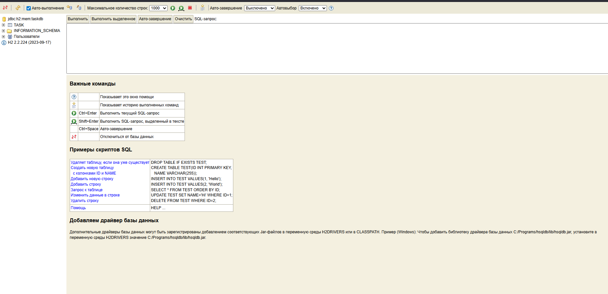
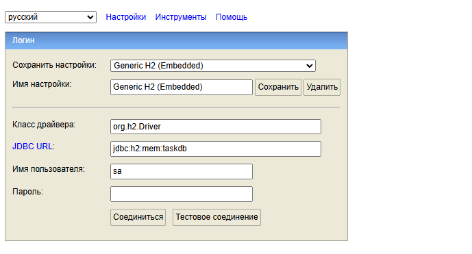

# Лабораторная работа: RESTful веб-приложение на Spring Boot

**Выполнил:** Аннануров Даниил Петрович  
**Группа:** ИВТ1.2  
**Курс:** 4

## Цель работы
Создать RESTful веб-приложение “Task Management System” для управления задачами с использованием Spring Boot, применяя ключевые компоненты фреймворка, включая автоматическую конфигурацию, стартеры, работу с базой данных и безопасность.

## Описание проекта
Приложение представляет собой систему управления задачами (Task Management System), которая позволяет выполнять CRUD операции (создание, чтение, обновление, удаление) над задачами.

### Используемые технологии
*   **Java 17**: Язык программирования.
*   **Spring Boot 3.3.0**: Основной фреймворк.
*   **Spring Web**: Для создания REST API.
*   **Spring Data JPA**: Для работы с базой данных.
*   **H2 Database**: Встраиваемая база данных (in-memory).
*   **Spring Security**: Для обеспечения базовой аутентификации.
*   **Lombok**: Для сокращения шаблонного кода (геттеры, сеттеры, конструкторы).

## Структура проекта
Проект организован по слоям:
*   `controller`: Обработка HTTP-запросов (`TaskController`).
*   `service`: Бизнес-логика (`TaskService`).
*   `repository`: Взаимодействие с базой данных (`TaskRepository`).
*   `model`: Сущности базы данных (`Task`).
*   `config`: Конфигурация безопасности (`SecurityConfig`).
*   `exception`: Обработка исключений (`ResourceNotFoundException`).

## Тестирование API

Для доступа к API используется Basic Authentication:
*   **Username:** `admin`
*   **Password:** `admin123`

## Работа с базой данных (H2 Console)
Для проверки данных можно использовать встроенную консоль H2.
*   **URL:** `http://localhost:8080/h2-console`
*   **JDBC URL:** `jdbc:h2:mem:taskdb`
*   **User Name:** `sa`
*   **Password:** `password`

## Заключение
В ходе выполнения лабораторной работы было создано полнофункциональное RESTful приложение на Spring Boot. Реализованы все требуемые CRUD операции, подключена база данных H2 и настроена базовая аутентификация с помощью Spring Security. Код структурирован с использованием слоев Controller-Service-Repository.

